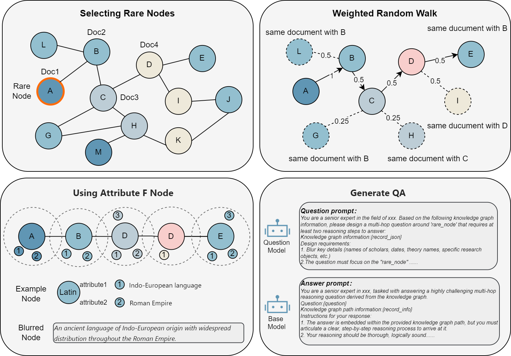
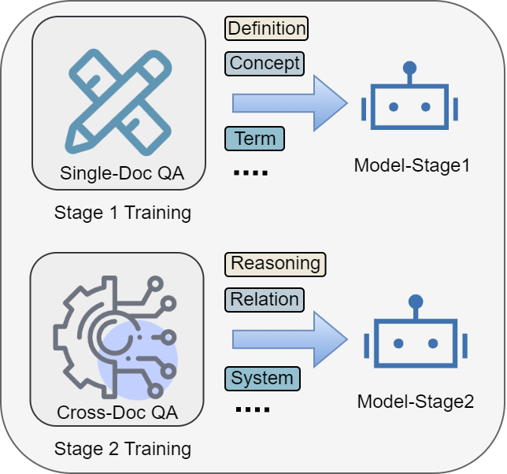

# KITE: 增强型 SFT 的知识增强增量训练

[](https://opensource.org/licenses/Apache-2.0)
[](https://www.python.org/)

**KITE** 是一个用于构建高性能领域专家 LLM 的通用框架。它通过新颖的知识图谱 (KG) 驱动的数据合成管道和“局部到全局”的渐进式训练策略，解决了领域适应中复杂推理数据稀缺和灾难性遗忘的挑战。

## 🚀 核心特性

- **KG 驱动的数据合成**：利用领域知识图谱生成跨文档、多跳 QA 对。
- **稀有节点引导探索**：通过加权随机游走优先考虑“长尾”知识，确保多样化覆盖。
- **歧义节点构造**：用属性掩盖实体名称，强制进行多步推导，防止捷径学习。
- **两阶段渐进式训练**：
  - **阶段 1**：单文档知识内化。
  - **阶段 2**：跨文档知识整合与复杂推理。
- **灾难性遗忘缓解**：使用基模型自我修正和参数高效微调 (LoRA)。

## 🏗️ 框架架构

KITE 框架主要包含四个阶段：

1.  **知识图谱构建**：从领域语料库中详细提取实体、关系和属性，并进行溯源追踪。
2.  **单文档数据合成**：从单个文档块生成事实性 QA 对。
3.  **跨文档数据合成**：利用稀有节点引导的随机游走和多样性约束，构建跨多个文档的复杂推理路径。

    

4.  **渐进式训练**：一种课程学习方法，首先在单文档数据上微调模型，然后在跨文档推理数据上进行微调。

    

## 🛠️ 安装

```bash
git clone https://github.com/yourusername/KITE.git
```


## 🏃 使用方法

### 1. 数据准备
准备 JSONL 格式的领域语料库：
```jsonl
  {"id": "doc1", "content": "文本内容..."},
  {"id": "doc2", "content": "文本内容..."}
```

### 2. 知识图谱构建
利用 langextract 提取实体并构建图谱：
```bash
python extract_graph.py
```
将 json 文件转化到 neo4j：
```bash
python json2neo4j.py
```

### 3. 数据合成
识别稀有节点：
```bash
python rare_node.py
```
跨文档加权随机游走：
```bash
python cross_doc_walk.py
```
生成问题：
```bash
python generate_qa.py
```
生成答案：
```bash
python generate_answer.py
```

## 📜 引用

如果您在研究中使用了 KITE，请引用我们的论文：

```bibtex

```

## 📄 许可证

本项目采用 Apache 2.0 许可证 - 详情请参阅 [LICENSE](LICENSE) 文件。
